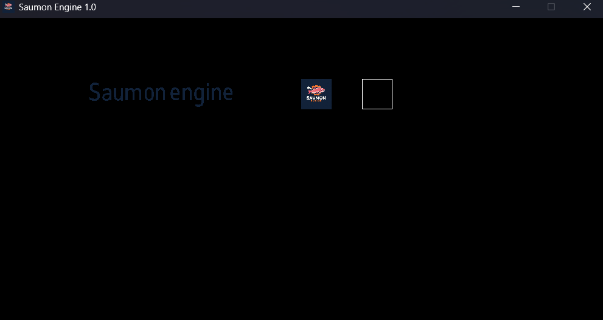
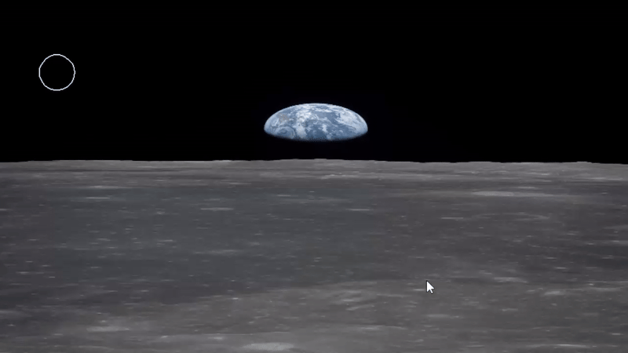
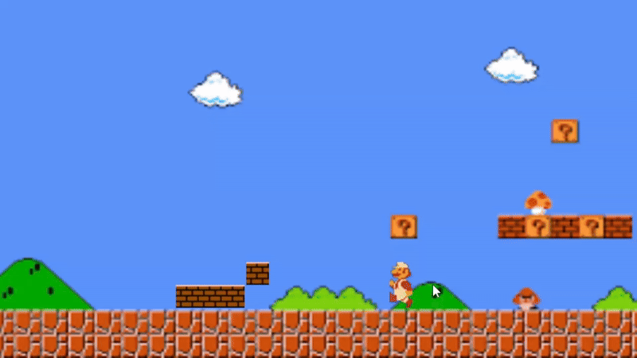

# 2D Engine (c++ - SDL)

A 2D engine developed in five days, based on a homemade 2D library that encapsulates SDL.


## Features 
- Can display sprites, animations, circles and rectangles
- Collision between entities (with different colliders ; rectangle x circle)
- Realistic physics (gravity and bouncing)
- Functionnal buttons, sounds mixers

## Showcase
- shows
   - buttons
   - display
   - gravity on earth and moon, with different objects
   - a little mario game
- N -> next slide (when there's no button)
- D -> activate gravity (in the second slide)
  

## Screenshots

Display 



Moon gravity with a bowling ball



Tiny Mario game



## Installation

1. Clone the repository:
   git clone https://github.com/slucasss/2DEngine.git

2. Get the .sln for visual studio
```bash
  .\SolutionGenerator.exe -make ./
```

3.Open it in visual studio

4. Run
